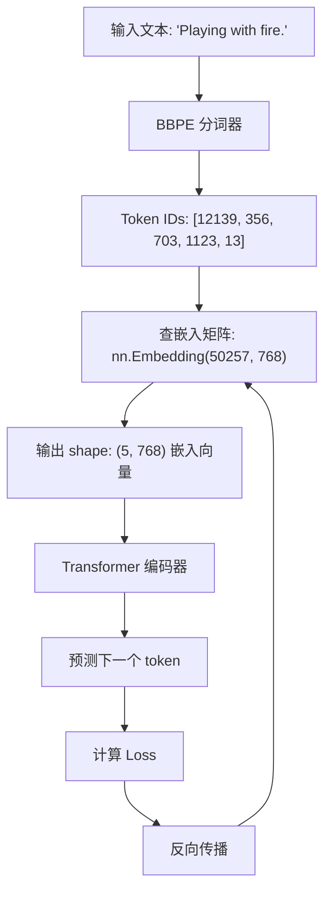

---
{"dg-publish":true,"dg-permalink":"/大语言模型学习/词嵌入/介绍","dg-home":false,"dg-description":"在此输入笔记的描述","dg-hide":false,"dg-hide-title":false,"dg-show-backlinks":true,"dg-show-local-graph":true,"dg-show-inline-title":true,"dg-pinned":false,"dg-passphrase":"在此输入访问密码","dg-enable-mathjax":false,"dg-enable-mermaid":false,"dg-enable-uml":false,"dg-note-icon":0,"dg-enable-dataview":false,"tags":["NLP"],"permalink":"/大语言模型学习/词嵌入/介绍/","dgShowBacklinks":true,"dgShowLocalGraph":true,"dgShowInlineTitle":true,"dgPassFrontmatter":true,"noteIcon":0,"created":"2025-04-02T21:42:06.000+08:00","updated":"2025-05-07T15:21:57.000+08:00"}
---


# 博客笔记：深入理解词嵌入（Embedding）技术及其实现

## 元数据
- **分类**：自然语言处理（NLP）
- **标签**：Embedding、词向量、PyTorch、深度学习
- **日期**：2025年4月1日  

---


## 1. 什么是词嵌入（Embedding）？
词嵌入（Embedding）是一种将高维数据（如文本或图像）映射到低维向量空间的技术。它的核心功能是将计算机无法直接理解的物理量（如文字、图片、语言等）转化为计算机可以处理的稠密向量，同时尽量保留原始信息。

💡 **启发点**：Embedding 的本质是一种映射关系，可以看作是从复杂的现实世界到计算机可操作世界的一种"翻译"。

### 核心特性
1. **单射性和同构性**：Embedding 是单射的映射，意味着每个输入都有唯一的输出。
2. **高维到低维**：通过稠密向量表征高维数据，减少计算复杂度。
3. **可学习参数矩阵**：Embedding 是一个全连接层，可通过训练优化。

---


## 2. Embedding 的实现与工作机制

### 2.1 PyTorch 实现
在 PyTorch 中，常用 `nn.Embedding(vocab_size, embed_dim)` 来实现词嵌入：
- `vocab_size`：词表大小，即可能出现的词汇总数。
- `embed_dim`：词向量的维度，决定了每个词在向量空间中的表示复杂度。

```python
import torch.nn as nn

# 定义一个Embedding层
embedding = nn.Embedding(vocab_size=10000, embed_dim=300)

# 示例输入：索引形式的单词
input_indices = torch.tensor([1, 5, 8])

# 输出：对应的词向量
output_vectors = embedding(input_indices)
```

💡 **启发点**：通过查表（lookup）代替矩阵乘积，大幅提升性能。

---


### 2.2 Embedding 的物理意义
用一个简单的比喻，Embedding 就像地图：
- 地图是现实地理信息的二维表示，而真实地形可能是多维的。
- Embedding 将文字、图片等复杂数据映射到低维空间，同时尽量保留其语义信息。

📈 **趋势预测**：
随着更强大的模型和硬件支持，未来 Embedding 的维度和表现能力将进一步提升，可能会出现更高效的多模态嵌入技术。

---


## 3. 常见错误与注意事项
⚠️ **常见错误**
- **词表外词汇问题**：对于未在训练中出现的词汇，Embedding 层可能无法生成有效表示。
- **过小的词向量维度**：可能导致语义信息丢失。
- **过大的词向量维度**：可能导致过拟合，增加计算成本。


---


## 5. 行动清单
✅ 学习 PyTorch 中 `nn.Embedding` 的更多用法  
✅ 探索不同维度大小对模型性能的影响  
❗️ 实验如何处理 OOV（词表外）问题  

---


## 6. [思考] 延伸问题
1. 如何设计更高效的 Embedding 方法以适应多模态数据（如文本+图像）？
2. 在实际应用中，如何平衡 Embedding 的维度和模型性能？
3. 是否可以通过预训练技术进一步提升 Embedding 的泛化能力？

---


## 7. 后续追踪研究计划
- 探索基于 Transformer 的动态词嵌入方法。
- 比较不同深度学习框架中 Embedding 层的实现差异。
- 调研最新的多模态嵌入技术及其应用场景。

---

>


